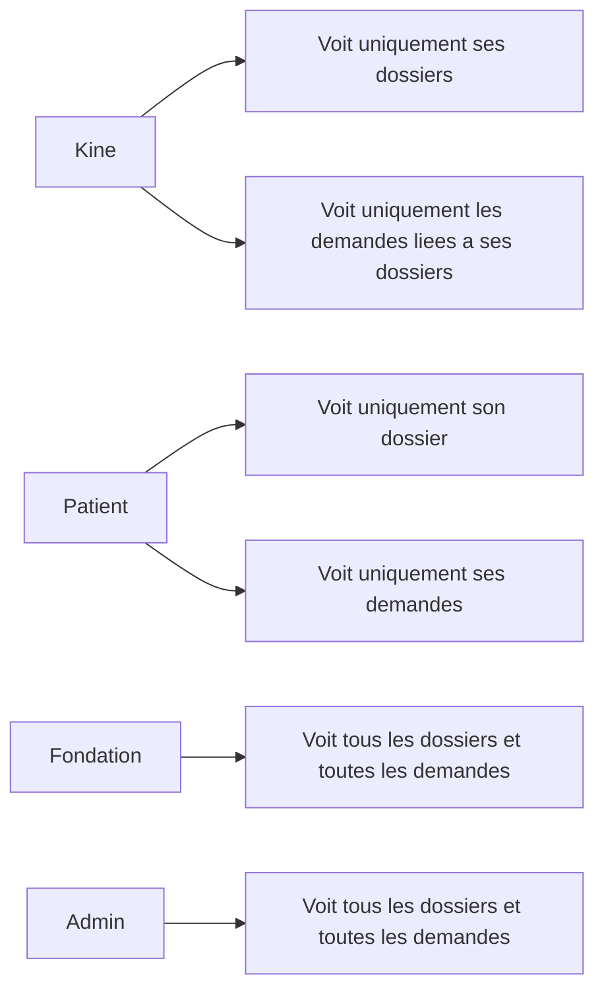

# Roles et acces

Ce document presente, de facon simple, qui peut voir quoi et faire quoi dans la plateforme Entre Vos Mains.

L'objectif est double :

- garantir que chaque acteur dispose d'un role clair
- proteger les dossiers et les demandes pour eviter tout acces non autorise

## Principe general

La plateforme distingue 4 roles :

- `Kine` : professionnel qui introduit et suit les dossiers
- `Patient` : beneficiaire qui consulte son dossier et gere ses demandes
- `Fondation` : equipe interne qui instruit les dossiers et demandes
- `Admin` : administration de la plateforme

## Vue rapide

Le principe est simple :

- les roles `Kine` et `Patient` sont des roles portail
- les roles `Fondation` et `Admin` sont des roles internes
- un utilisateur portail ne peut jamais acceder aux dossiers ou demandes d'une autre personne

## Matrice d'acces

| Role | Type d'acces | Dossiers | Demandes de paiement | Portee |
|---|---|---|---|---|
| Kine | Portail | Lire, creer, modifier | Lire | Uniquement ses dossiers et les demandes associees |
| Patient | Portail | Lire | Lire, creer, modifier, supprimer | Uniquement son dossier et ses demandes |
| Fondation | Interne | Acces complet | Acces complet | Tous les dossiers et toutes les demandes |
| Admin | Interne | Acces complet | Acces complet | Tous les dossiers et toutes les demandes |

## Comment lire cette matrice

- `Lire` signifie consulter une information existante
- `Creer` signifie ajouter un nouvel element
- `Modifier` signifie mettre a jour un element existant
- `Supprimer` signifie retirer un element

En pratique, la matrice ne suffit pas seule.  
La plateforme applique aussi une regle d'isolement :

- un kine ne voit que ses propres dossiers
- un patient ne voit que son propre dossier
- un kine ne voit que les demandes rattachees a ses dossiers
- un patient ne voit que ses propres demandes

## Exemples concrets

### Exemple 1

- `Kine A` cree le dossier du `Patient A`
- `Kine B` cree le dossier du `Patient B`

Resultat :

- `Kine A` voit le dossier A, pas le dossier B
- `Kine B` voit le dossier B, pas le dossier A

### Exemple 2

- `Patient A` dispose d'un dossier accepte et de demandes de paiement
- `Patient B` dispose aussi de son propre dossier

Resultat :

- `Patient A` ne voit que son dossier et ses demandes
- `Patient B` ne voit que son dossier et ses demandes

### Exemple 3

- la `Fondation` traite les dossiers et demandes
- l'`Admin` gere la plateforme

Resultat :

- la `Fondation` voit l'ensemble des dossiers et demandes utiles a l'instruction
- l'`Admin` dispose d'un acces complet de supervision et d'administration

## Ce que cela garantit

- chaque acteur travaille dans un espace adapte a son role
- les donnees patient restent cloisonnees
- il n'y a pas d'acces transverse entre kines ou entre patients
- la fondation peut instruire les dossiers sans contournement manuel
- l'administration conserve un acces complet pour piloter la plateforme

## Prestataires

Le parcours dossier et paiement inclut desormais la notion de `prestataire`.

- la `Fondation` et l'`Admin` peuvent marquer un contact comme prestataire EVM
- un contact ne peut etre marque prestataire que si sa fiche contient au minimum un nom, un email et un compte bancaire
- la `Fondation` et l'`Admin` peuvent definir un prestataire par defaut sur la fiche contact du kine
- le `Kine` doit choisir un prestataire lors de la soumission d'un dossier
- si un prestataire par defaut est defini sur la fiche contact du kine, il est preselectionne sur le formulaire de creation du dossier
- la `Fondation` et l'`Admin` peuvent modifier le prestataire directement sur le dossier en back-office
- lors de la validation d'une demande de paiement, le beneficiaire du paiement Odoo est le prestataire du dossier, pas le patient

Cette regle aligne le workflow avec le fonctionnement retenu: la fondation paie le prestataire pour le compte du patient.

## Point d'attention

Ce document decrit le socle d'acces retenu a ce stade du projet.  
Les ecrans et parcours utilisateurs seront ajoutes progressivement, mais ils devront respecter ce cadre.
